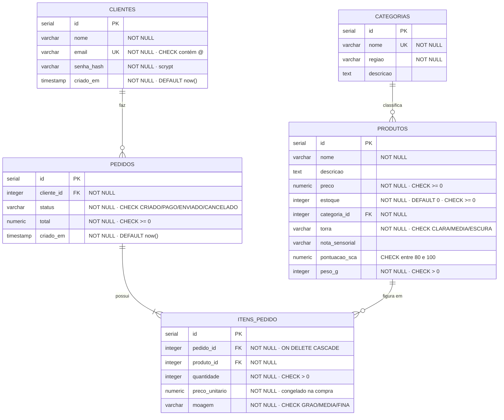

# Modelo de dados — Torra & Terra

Diagrama entidade-relacionamento, cardinalidades justificadas e a análise de
normalização até a 3FN.

---

## 1. Diagrama ER



---

## 2. Cardinalidades — por que cada uma é o que é

### `CLIENTES 1:N PEDIDOS`

Um cliente faz vários pedidos ao longo do tempo; cada pedido pertence a
exatamente um cliente. **Pedido sem cliente não faz sentido** — não haveria
para quem entregar nem para quem cobrar. Por isso `cliente_id` é `NOT NULL`.

O lado do pedido é opcional (`o{`): um cliente recém-cadastrado ainda não
comprou nada, e isso é um estado válido.

### `PEDIDOS 1:N ITENS_PEDIDO`

Um pedido tem no mínimo um item — a notação `|{` marca essa obrigatoriedade.
Pedido vazio seria transação quebrada pela metade, exatamente o que a
consulta 3.3 de `SQL/consultas.sql` verifica.

Esta é a única FK com `ON DELETE CASCADE`: item sem pedido é órfão, não tem
significado próprio. O inverso — apagar um cliente e levar junto os pedidos —
seria destruir histórico contábil, e por isso não tem cascade.

### `PRODUTOS 1:N ITENS_PEDIDO`

O mesmo café aparece em vários pedidos diferentes ao longo do tempo. O lado
do produto é opcional: um café recém-cadastrado ainda não foi vendido.

Repare que **não há cascade aqui**. Se um café sair de linha, o banco recusa
apagá-lo enquanto houver item apontando para ele — o histórico de vendas
precisa continuar legível.

### `CATEGORIAS 1:N PRODUTOS`

Cada café pertence a uma região; cada região tem vários cafés. `categoria_id`
é `NOT NULL`: **café sem origem não existe** neste domínio — a origem única é
justamente o que define café especial.

### Por que não há N:N no modelo

À primeira vista `PEDIDOS` e `PRODUTOS` teriam um relacionamento N:N, que
seria resolvido por uma tabela de ligação. Não é o caso aqui: `ITENS_PEDIDO`
tem **atributos próprios** — `quantidade`, `preco_unitario` e `moagem` — que
não pertencem nem ao pedido nem ao produto.

Isso a promove de tabela de ligação a **entidade associativa**. É a diferença
entre "estes produtos estão neste pedido" e "esta quantidade deste café,
moída assim, custou isto naquele dia".

---

## 3. Normalização

### 1FN — campos atômicos, sem grupos repetitivos

Todo campo guarda **um** valor. Nenhuma coluna acumula lista.

O caso que exige atenção é a nota sensorial: `"Bergamota, jasmim, pêssego
branco"` parece uma lista dentro de um campo. Aceitamos como **texto
descritivo único**, não como conjunto — ele é exibido inteiro, nunca filtrado
ou agregado por nota individual.

Se o requisito fosse "buscar todos os cafés com nota de jasmim", isso
quebraria a 1FN e exigiria uma tabela `notas_sensoriais` com N:N para
produtos. Está registrado como evolução, não como MVP.

Os itens do pedido também respeitam a 1FN: em vez de `produtos_comprados`
como lista dentro de `pedidos`, existe uma linha por item em
`itens_pedido` — a repetição virou tabela própria.

### 2FN — sem dependência parcial da chave

A 2FN só é violável quando a chave primária é composta. `ITENS_PEDIDO` é
onde isso apareceria: a chave natural seria
`(pedido_id, produto_id, moagem)`.

Analisando os atributos não-chave:

| Atributo | Depende de | Situação |
|---|---|---|
| `quantidade` | da combinação inteira | ✅ dependência total |
| `preco_unitario` | da combinação inteira — é o preço **daquele produto naquele pedido** | ✅ dependência total |

Nenhum atributo depende só de `pedido_id` (isso pertence a `pedidos`) nem só
de `produto_id` (isso pertence a `produtos`). **Está em 2FN.**

Se `nome_do_produto` estivesse em `itens_pedido`, aí sim haveria dependência
parcial: o nome depende só de `produto_id`. Ele não está lá — é lido por JOIN.

> Nota: usamos `id SERIAL` como chave primária e a combinação natural como
> `UNIQUE` (`uq_itens_pedido_produto_moagem`). A análise de 2FN vale sobre a
> chave candidata natural, que é o que importa conceitualmente.

### 3FN — sem dependência transitiva

Uma dependência transitiva acontece quando um campo não-chave depende de
outro campo não-chave.

**É exatamente por isso que `CATEGORIAS` existe separada.** Se a descrição da
região morasse em `produtos`:

```
produtos(id, nome, preco, regiao, descricao_da_regiao, ...)
```

teríamos `id → regiao → descricao_da_regiao`: a descrição depende da região,
que depende do id. Transitiva. As consequências práticas:

- **Redundância:** o texto do Cerrado Mineiro repetido em cada café da região
- **Anomalia de atualização:** corrigir a descrição exigiria alterar todas as
  linhas daquela região, e uma que escapasse deixaria o banco inconsistente
- **Anomalia de inserção:** não seria possível cadastrar uma região nova antes
  de existir um café dela
- **Anomalia de exclusão:** apagar o último café de uma região apagaria junto
  a informação sobre a região

Com a tabela separada, a descrição vive num lugar só. **Está em 3FN.**

### A desnormalização deliberada: `preco_unitario`

`itens_pedido.preco_unitario` duplica um dado que também está em
`produtos.preco`. Isso parece violar a normalização — e não viola.

Os dois campos têm **significados diferentes**:

- `produtos.preco` = quanto este café custa **hoje**
- `itens_pedido.preco_unitario` = quanto este café custou **naquela compra**

Não é redundância: é um fato histórico independente. Se lêssemos
`produtos.preco` para exibir um pedido antigo, o histórico se reescreveria a
cada reajuste e o `total` gravado deixaria de bater com a soma dos itens.

É a resposta ao teste mental do material: *"o que acontece se o produto mudar
de preço? Onde o histórico deve ficar?"* — fica no item, congelado.

O teste `test_preco_unitario_fica_congelado_apos_reajuste` prova esse
comportamento.

---

## 4. Checklist de validação do modelo

- [x] Toda tabela tem chave primária
- [x] Todo relacionamento tem chave estrangeira
- [x] Nenhum campo monetário usa `FLOAT` — todos `NUMERIC(10,2)`
- [x] Toda regra de negócio relevante virou constraint, não ficou "na cabeça"
- [x] As cardinalidades foram validadas com exemplos reais de compra
- [x] Um pedido sem cliente é impossível (`NOT NULL` + FK)
- [x] Um produto sem categoria é impossível (`NOT NULL` + FK)
- [x] O histórico sobrevive a mudança de preço (`preco_unitario` congelado)
- [x] O modelo está em 3FN, com uma desnormalização documentada e justificada
