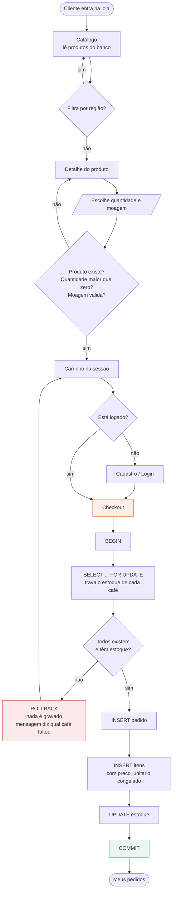

# Requisitos — Torra & Terra

Disciplina: Tratamento e Armazenamento da Informação · FACAMP
Professor: Nivaldo T. Marcusso

Documento do Bloco 1 do projeto: escopo, atores, requisitos funcionais e não
funcionais, critérios de aceite, backlog priorizado e fluxo do processo.

---

## 1. Problema de negócio

Torrefações de café especial vendem hoje por telefone, WhatsApp e planilha. O
controle de estoque é manual e o pedido é anotado à mão. Isso produz duas dores
recorrentes:

- **Perda de controle do estoque** — o mesmo lote é vendido duas vezes porque
  duas vendas aconteceram em paralelo e ninguém baixou o saldo a tempo.
- **Pedido inconsistente** — o pedido é registrado pela metade: o cabeçalho
  existe mas os itens não, ou o total não corresponde aos itens.

**Pergunta central:** como estruturar uma loja online que liste os cafés, monte
um carrinho e conclua o pedido *com integridade garantida pelo banco de dados*?

O tema café especial foi escolhido de propósito. Cada item do pedido carrega a
**moagem** escolhida pelo cliente na hora da compra — um atributo que existe só
no item, nunca no produto. É isso que faz `itens_pedido` ser uma entidade de
verdade e não uma mera tabela de ligação.

---

## 2. Atores

| Ator | Objetivo | No MVP? |
|---|---|---|
| **Cliente** | Encontrar cafés, saber preço, escolher moagem e concluir a compra | **Sim** |
| **Operação** | Controlar estoque, pedidos e clientes sem retrabalho | Parcial — o estoque baixa sozinho no checkout, mas não há tela de operação |
| **Gestão** | Relatórios de vendas, volume e produtos mais vendidos | **Não** — fora do MVP |
| **TI/Desenvolvimento** | Ter escopo claro para modelar, programar e testar | **Sim** — este documento |

---

## 3. Requisitos funcionais

| ID | Requisito | Prioridade |
|---|---|---|
| **RF01** | Catálogo: listar os cafés lendo do banco, com filtro por categoria/região | Alta |
| **RF02** | Detalhe do produto: nota sensorial, torra, pontuação SCA, peso | Alta |
| **RF03** | Carrinho: adicionar item escolhendo quantidade **e moagem**, guardado na sessão | Alta |
| **RF04** | Cadastro e login do cliente, com senha armazenada apenas como hash | Alta |
| **RF05** | Checkout: transformar o carrinho em pedido persistido e baixar o estoque, em transação única | **Crítica** |
| **RF06** | Meus pedidos: histórico do cliente logado com os itens de cada pedido | Média |

### Critérios de aceite

**RF01 — Catálogo**
- A listagem vem do banco, nunca de dados fixos no código
- Cada card mostra nome, região, torra, pontuação SCA e preço em `R$ 0,00`
- O filtro por categoria retorna só os cafés daquela região
- Sem filtro, todos os cafés aparecem ordenados por nome

**RF02 — Detalhe do produto**
- Produto inexistente retorna 404, não erro 500
- A página mostra nota sensorial, torra, pontuação SCA e peso em gramas
- A partir dela é possível adicionar ao carrinho escolhendo moagem e quantidade

**RF03 — Carrinho**
- O produto precisa existir para entrar no carrinho
- A quantidade precisa ser positiva
- A moagem precisa ser uma das três: `GRAO`, `MEDIA` ou `FINA`
- O mesmo café em duas moagens diferentes ocupa **duas linhas** distintas
- O total é recalculado a cada alteração
- O carrinho sobrevive à navegação entre páginas (fica na sessão)

**RF04 — Cadastro e login**
- E-mail é único; tentar cadastrar um repetido dá mensagem clara, não erro 500
- A senha nunca é gravada em texto puro — só o hash
- Login com credencial errada não revela se o erro foi no e-mail ou na senha
- Rotas protegidas redirecionam quem não está logado para o login

**RF05 — Checkout** *(o requisito mais importante)*
- Ou grava tudo — pedido, itens e baixa de estoque — ou não grava nada
- Estoque insuficiente em qualquer item: rollback completo e mensagem dizendo
  **qual** café faltou e quanto havia disponível
- Produto que não existe mais: o pedido não é finalizado
- O `preco_unitario` é congelado no item no momento da compra
- Duas compras simultâneas não vendem o mesmo lote (`SELECT ... FOR UPDATE`)
- Depois de um checkout que falhou, o estoque continua exatamente como estava

**RF06 — Meus pedidos**
- Só mostra os pedidos do cliente logado, nunca os de outro
- Cada pedido lista seus itens com a moagem e o preço congelado da época

---

## 4. Requisitos não funcionais

| ID | Categoria | Requisito | Como é verificado |
|---|---|---|---|
| **RNF01** | Integridade | As regras de negócio vivem no banco como constraints, não só na aplicação | `SQL/schema.sql` + teste que tenta inserir preço negativo |
| **RNF02** | Integridade | O checkout é atômico: commit total ou rollback total | `tests/test_checkout.py` |
| **RNF03** | Segurança | Senhas só como hash (`werkzeug.security`); nenhum segredo no código-fonte | `.env` no `.gitignore`, teste de senha em texto puro |
| **RNF04** | Segurança | A aplicação conecta com usuário próprio do PostgreSQL, não com o superusuário | `SQL/usuario_app.sql` |
| **RNF05** | Desempenho | Consultas de catálogo e histórico apoiadas por índice | `EXPLAIN` antes/depois em `SQL/consultas.sql` |
| **RNF06** | Disponibilidade | Aplicação publicada em cloud com HTTPS e deploy automático a cada push | URL pública funcionando |
| **RNF07** | Usabilidade | Interface mobile-first, contraste mínimo AA, `<label>` em todo input | Abrir no celular |
| **RNF08** | Recuperação | Backup lógico com `pg_dump` e restauração testada | Seção no `README.md` |

---

## 5. Backlog priorizado

### MVP — entra agora

1. Schema com todas as constraints e os 4 índices
2. Carga inicial: 12 cafés em 4 regiões
3. Catálogo e detalhe do produto
4. Cadastro, login e sessão
5. Carrinho com escolha de moagem
6. **Checkout transacional**
7. Meus pedidos
8. Testes automatizados e evidências

### Evolução — fora do MVP, documentado como próximo passo

- Pagamento real (gateway) e cálculo de frete
- **Controle de lote e data de torra** — evolução natural do domínio: café tem
  validade curta e a data de torra é informação de venda
- Área administrativa para a Operação cadastrar produtos e mudar status do pedido
- Relatórios de vendas para a Gestão
- Carrinho persistente entre dispositivos (aqui um Redis passaria a fazer sentido)
- Avaliações e notas dos clientes por café

---

## 6. História de usuário de referência

```
Como cliente
Quero adicionar cafés ao carrinho escolhendo a moagem
Para receber o café pronto para o meu método de preparo

Critérios de aceite:
- o produto deve existir
- a quantidade deve ser positiva
- a moagem deve ser GRAO, MEDIA ou FINA
- o sistema deve recalcular o total
- o mesmo café em moagens diferentes conta como dois itens
```

---

## 7. Fluxo do processo



Os losangos são os **pontos de validação**. Repare que `V1` valida no formulário
e `V2` valida dentro da transação, já com o registro travado — a validação dupla
é o RNF01 na prática.

---

## 8. Limitações conhecidas do MVP

Documentadas de propósito, conforme a dica do Bloco 6:

- **Sem pagamento real.** O pedido nasce com status `CRIADO`; não há gateway.
- **Sem frete.** O total é a soma dos itens.
- **Sem controle de lote e data de torra.** É a evolução mais natural do domínio.
- **Sem área administrativa.** Produtos e estoque são carregados via `seed.sql`.
- **Sem relatórios.** A Gestão está fora do MVP.
- **Carrinho na sessão, não no banco.** Decisão consciente: no MVP o carrinho é
  processo, não entidade. Ele se perde ao trocar de dispositivo.
